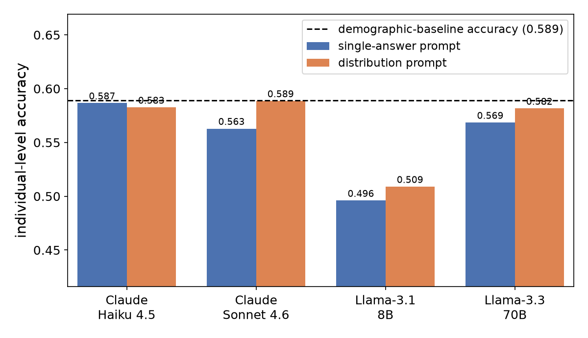
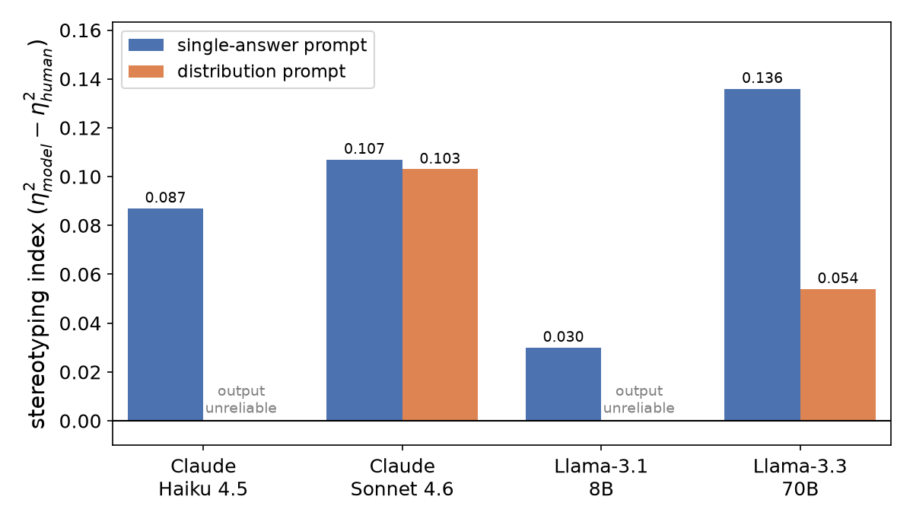

# When Synthetic Users Fail: A Cross-Domain Benchmark of LLM-Simulated Human Survey Responses

**Authors:** Zihan Chen, Di Zhu, and Lei Nico Zheng

[](https://doi.org/10.48550/arXiv.2607.26348)
[](https://huggingface.co/datasets/ZihanChen/when-synthetic-users-fail)
[](LICENSE)
[-lightgrey.svg)](LICENSE-DATA)
[](https://www.python.org/)

This paper examines whether large language models can reliably simulate human survey responses. Using the General Social Survey and World Values Survey, it benchmarks four LLMs against non-LLM baselines and identifies two recurring failures under the tested protocols: weak individual-level prediction and exaggerated relationships between demographics and attitudes. These distortions can mislead decisions about which population segments to target.

This repository provides the data, cached model outputs, experimental results, and analysis scripts needed to reproduce every table and figure in the paper.

## Read the paper

- **arXiv Link:** [https://doi.org/10.48550/arXiv.2607.26348](https://doi.org/10.48550/arXiv.2607.26348)
- **Online PDF:** [https://arxiv.org/pdf/2607.26348](https://arxiv.org/pdf/2607.26348)

## Key findings

**1. No LLM beats a simple demographic baseline at the individual level.**

| Δbase (accuracy − baseline) | GSS (U.S. attitudes) | WVS (cross-cultural values) |
|---|---|---|
| Claude Haiku 4.5 | −0.0025 | −0.2178 |
| Claude Sonnet 4.6 | −0.0262 | −0.1519 |
| Llama 3.1-8B | −0.0932 | −0.2088 |
| Llama 3.3-70B | −0.0206 | −0.1389 |

*Single-answer prompt (Style A), both seeds. Every cell is negative.*

**2. Models systematically over-determine demographics.** They treat identity as far
more predictive of attitudes than it is among real people. On WVS this holds for
126 of 128 question–group pairs (114 with confidence intervals excluding zero).

<table>
<tr>
<td><br><em>GSS — individual accuracy vs. baseline</em></td>
<td><br><em>WVS — demographic over-determination</em></td>
</tr>
</table>

## Quick start: reproduce the paper

No API key, no raw survey data, and no model calls are needed — all 50,076 model
outputs are cached in this repository. Clone or download the repository, then from
its root:

```bash
make setup     # create .venv and install pinned dependencies   (~2 min)
make smoke     # check that the checkout is complete             (~30 s)
make verify    # regenerate the main results table, diff vs paper (<1 min)
```

On success, `make verify` prints:

```
VERIFIED -- 16 rows regenerated from cached model outputs and
matching the published table exactly.
```

Then run `make reproduce` (30–60 min) to regenerate every metric and figure under
`experiment/analysis/{GSS,WVS}/`.

> **Requires Python ≥ 3.11.** macOS ships 3.9 as `python3`; use
> `make setup PYTHON=python3.12` (or another 3.11+ interpreter).

To run a single analysis script:

```bash
cd experiment/code
LLM_FAULTS_DATASET=WVS ../../.venv/bin/python analyze_decision_impact.py   # or GSS
```

## Benchmark your own model

Evaluate your own model on the same human ground truth and baseline as the paper:

```bash
# 1. export the exact prompts used in the paper
python examples/evaluate_your_model.py export --domain GSS --out prompts.jsonl

# 2. run the prompts through your model, then score the outputs
python examples/evaluate_your_model.py score --domain GSS --predictions preds.jsonl
```

`preds.jsonl` needs `respondent_id`, `question_id`, and either `pred` (an integer
answer code) or `raw` (the model's text). You get individual accuracy, Δbase against
the same non-LLM baseline, and a comparison with the paper's four models.
`examples/load_benchmark.py` shows how to load the data directly.

The GSS benchmark is also on Hugging Face, with the prompts built in, so you can
evaluate a model without cloning this repository:

```python
from datasets import load_dataset
bench = load_dataset("ZihanChen/when-synthetic-users-fail", "benchmark", split="test")
```

See the [dataset card](https://huggingface.co/datasets/ZihanChen/when-synthetic-users-fail) for the tables and a scoring example. The WVS half is
available only here, under the WVSA terms (see [LICENSE-DATA](LICENSE-DATA)).

## What's in this repository

| Path | Contents |
|---|---|
| `experiment/code/` | the full pipeline: dataset build, prompting, inference runners, metrics, analyses, figures |
| `experiment/datasets/*/build/llm_runs/` | 39,216 cached model calls with verbatim completion text |
| `experiment/datasets/*/build/robustness_runs/` | 10,860 cached calls for the prompt-perturbation analysis (option order, persona) |
| `experiment/datasets/*/build/*.parquet` | derived human-response tables, evaluation sample, baseline predictions, fit/eval splits |
| `experiment/analysis/{GSS,WVS}/` | all metric files, summary tables, and figures reported in the paper |
| `expected/` | reference copy of the main table, used by `make verify` |
| `examples/` | data loader and bring-your-own-model evaluation script |
| `scripts/` | smoke test, verification script, and the Hugging Face release builder (`build_hf_dataset.py`) |
| `docs/` | [DATA.md](docs/DATA.md) (every file and column), [REPRODUCE.md](docs/REPRODUCE.md) (pipeline and output-to-paper mapping), [RAW_DATA.md](docs/RAW_DATA.md) (obtaining the source surveys) |

### The two domains

| | GSS | WVS |
|---|---|---|
| Population | U.S. adults, 2016–2024 | 63 countries, Wave 7 (~2017–2022) |
| Respondents | 14,704 | 91,760 |
| Questions | 10 attitude items | 16 ordinal value items |
| Evaluation sample | 993 | 1,458 |
| Cached calls per model | 3,972 | 5,832 |

Both domains run through one protocol; `LLM_FAULTS_DATASET` (`GSS` or `WVS`) selects
the domain.

## Data availability

- **GSS:** the derived tables are included in full. NORC distributes the GSS
  publicly without registration.
- **WVS:** the full respondent-level table is **not** included, because the World
  Values Survey terms restrict redistribution of the microdata. A schema-identical
  1,985-row demonstration sample (`wvs_pilot_long_SAMPLE.parquet`) is included
  instead, along with the evaluation sample and aggregate distributions needed to
  verify the paper. To rebuild the full table, accept the WVS agreement, download
  the data, and follow [RAW_DATA.md](docs/RAW_DATA.md) (~10 min).

This affects one script, `analyze_rq1_robustness.py` on WVS; `make reproduce` skips
it, and its published output is included. **If you use the derived tables, please
also cite the GSS and WVS** (citations in [LICENSE-DATA](LICENSE-DATA)).

Running new model inference is optional; see
[REPRODUCE.md](docs/REPRODUCE.md#stage-2--model-inference-optional).

## Citation

If you use this work, please cite the arXiv preprint:

Chen, Zihan, Di Zhu, and Lei Nico Zheng. "When Synthetic Users Fail: A Cross-Domain Benchmark of LLM-Simulated Human Survey Responses." *arXiv preprint arXiv:2607.26348* (2026).

```bibtex
@article{chen2026syntheticusersfail,
  title={When Synthetic Users Fail: A Cross-Domain Benchmark of LLM-Simulated Human Survey Responses},
  author={Chen, Zihan and Zhu, Di and Zheng, Lei Nico},
  journal={arXiv preprint arXiv:2607.26348},
  year={2026}
}
```

## License

Code is released under the MIT License ([LICENSE](LICENSE)); data and figures under
CC BY 4.0 ([LICENSE-DATA](LICENSE-DATA)), except the WVS-derived files in
`experiment/datasets/WVS/build/`, which are provided for non-profit replication
only under the WVSA conditions of use. The underlying GSS and WVS data remain
governed by their originators' terms. The paper itself is distributed by arXiv under
its own license and is not covered by the licenses in this repository.

Built with Llama: the cached outputs include text generated by Llama 3.1 and
Llama 3.3 models, which are subject to the Llama 3.1 and Llama 3.3 Community License
Agreements.
